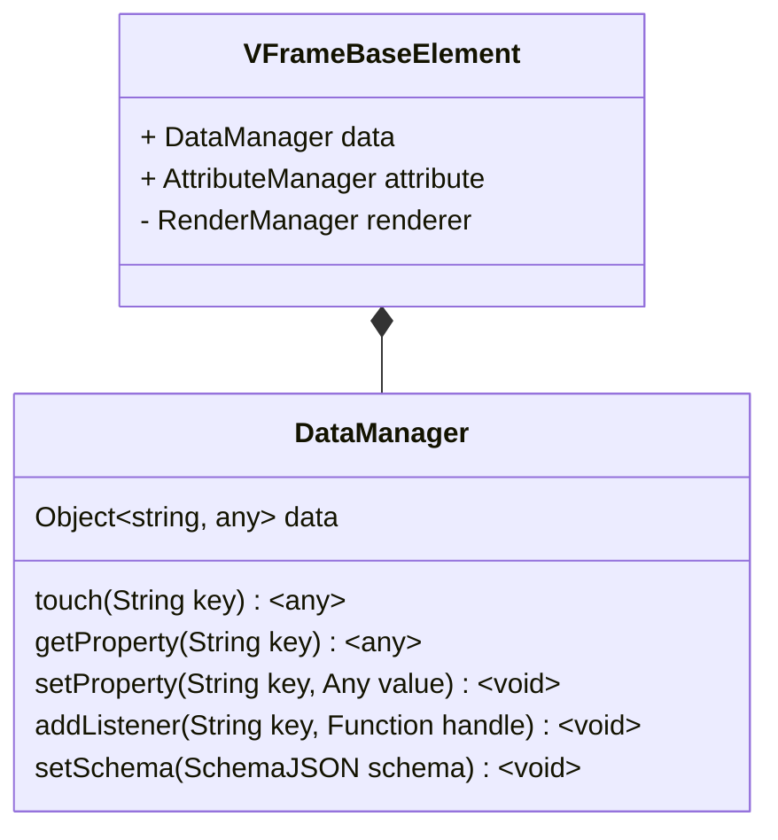

# Structure

## Base



```typescript
const $elem = document.querySelector('#example') as BaseVFrameElemen;
$elem.data.setProperty('src', 'http://itharbors.com');
```

## Life Cycle

```typescript
class VFrameInputElement extends {
    onInit(): void;
    onMounted(): void;
    onRemoved(): void;
}
```

## Data Update

```typescript
class VFrameInputElement extends {
    onInit() {
        this.data.addListener('src', (value) => {
            this.renderer.querySelector('.webview').src = value;
        });
    }
}
```