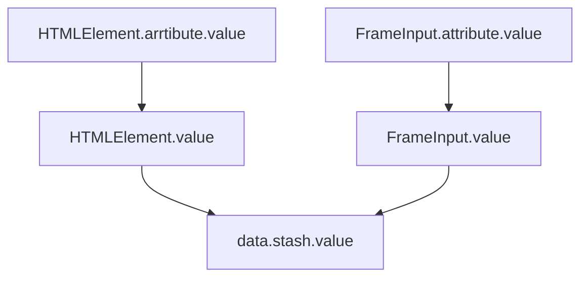
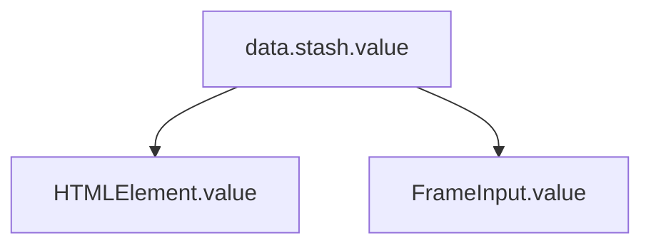
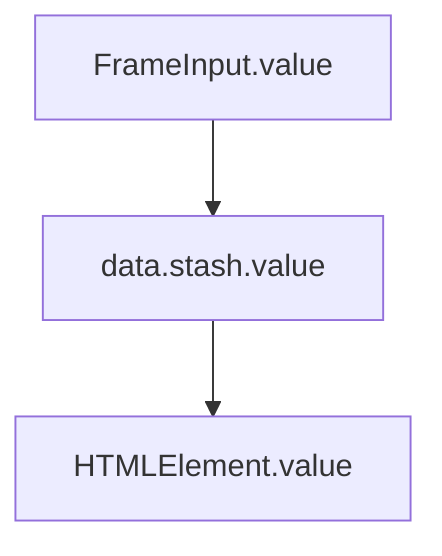
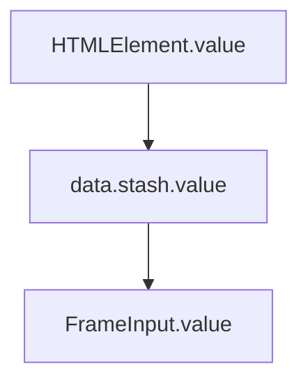

# 数据同步机制

## 数据被动修改时的流向

```mermaid
flowchart TD
    A[HTMLElement.value]
    B[HTMLElement.arrtibute.value]

    C[data.stash.value]

    D[FrameInput.value]
    E[FrameInput.attribute.value]

    A --> C

    B --> A

    D --> C
    E --> D
```

## 数据主动修改时的流向

```mermaid
flowchart TD
    A[HTMLElement.value]
    C[data.stash.value]
    D[FrameInput.value]

    C --> A
    C --> D
```

## 修改方式

### 选中键盘输入

```mermaid
flowchart TD
    A[HTMLElement.value]
    C[data.stash.value]
    D[FrameInput.value]

    D --> C --> A
```

### 修改 attribute

```mermaid
flowchart TD
    A[HTMLElement.value]
    C[data.stash.value]
    D[FrameInput.value]

    A --> C --> D
```